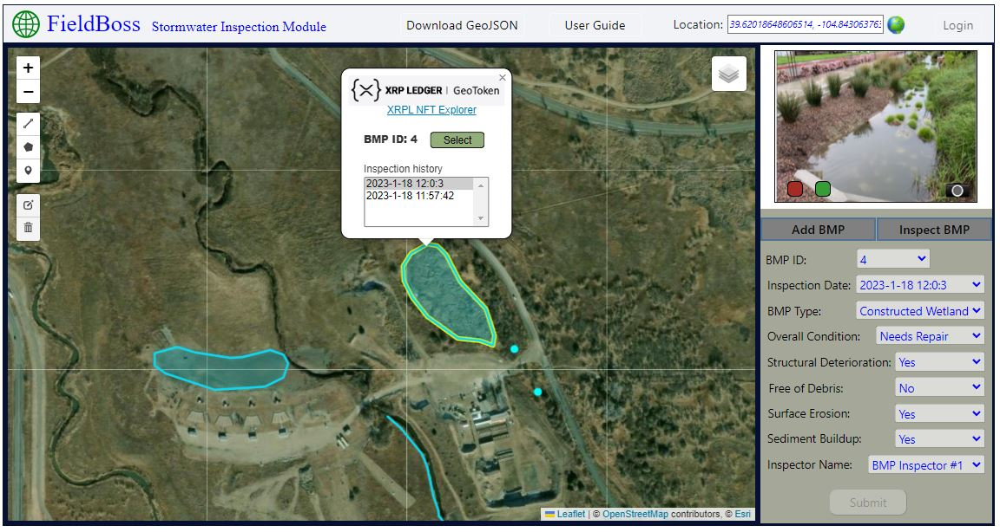

Welcome to FieldBoss!
---------------------

_FieldBoss_ is a prototype GIS application that incorporates Distributed Ledger Technology (Blockchain) into the process of collecting and storing spatial geometries (points, line, polygons). _**[Open FieldBoss Here](https://dev.dt5hj1vwo18dz.amplifyapp.com)**_  Click a feature on the map to display a popup and click 'select' to view recent inspection data. Zoom to your current location by clicking the 'globe' button and start collecting and reviewing spatial data. See 'Navigating the UI' for specific instructions. (Note: the default theme is Stormwater Inspection) FieldBoss is adaptable and can be used to collect any type of data at any location.  

Table of Contents
1.  [What Is FieldBoss](#what-is-fieldboss)
2.  [What Is A Geo-Located NFT](#what-is-a-geo-located-nft)
3.  [A FieldBoss Use Case](#about-the-project)
4.  [Getting Started](#getting-started)
5.  [Navigating the UI](#navigating-the-ui)
6.  [Built With](#built-with)
7.  [Roadmap](#roadmap)
8.  [Contact](#contact)

What Is FieldBoss
-----------------

_**FieldBoss**_ is a mapping application that merges blockchain technology with popular open source GIS mapping tools through the use of geo-located XRPL NFTs. With FieldBoss, GIS applications are extended to include the real-time tokenization of 2d/3d unique geometries collected by field crews. By combining the analytical power of GIS (assets represented spatially) with the transparency, immutability, and security of blockchain technology we can show the spatial and temporal distribution of information which is securely stored on blockchain and distributed file systems.

What Is A Geo-Located NFT
-------------------------

GeoJSON is an open standard format (based on JSON format) designed for representing geographical features (geometries), along with their non-spatial attributes. The features include points, lines, polygons, and multi-part collections. A geo-located NFT contains spatial geometries stored in the XRP Ledger as GeoJSON. The data describing the NFT is stored as related metadata in a distributed file system. As a result, an NFT's location can be derived and plotted onto a map and non-spatial attributes assigned to the location.

Geo-located XRPL NFTs adhere to the GeoJSON spatial data standard recognized by most GIS mapping applications which provides interoperability between FieldBoss and GIS.

A FieldBoss Use Case
--------------------

The _**FieldBoss**_ application is designed to be an easy to use map based data collection tool that incorporates the concept of decentralized spatial data collection and storage. Built with interchangeable React Components, it can be easily tailored for most field mapping needs.

Here we present a _**FieldBoss**_ use case showing how geo-located NFTs created on the XRP Ledger can be used in a field mapping application that performs and manages routine inspections of stormwater abatement structures (BMPs). Each structure on the map is represented as a point, line, or polygon feature. The geometry of these features is stored within an NFT on the XRP Ledger. New structures can be added and existing structures can be inspected. A record of all inspections (current and previous) for each feature is stored in a decentralized file system (Ceramic) and retrievable through the application's data form.

Getting Started
---------------

The _**FieldBoss**_ application has been deployed on AWS as a web service available to all. No installation or configuration is required. This web service application serves as a demo and is designed to be a 'sandbox' that can be used to collect 'real data' in the field.

*   Supported Browsers:
    *   Chrome
    *   Brave
    *   FireFox
    *   Edge
    *   Not formatted for mobile phones

Navigating the UI
-----------------

This application uses the Testnet on the XRP Ledger. A default account has been created for BMP Inspector #1 and the account details are embedded into the code. As a result, no login is required and all XRP Ledger transactions will use that account. In a production environment, each user (inspector/organization) will have a separate account on XRPL Mainnet and login will be required.

The application UI is divided into 3 interacting components including the navigation bar, data form, and interactive map. Following is a description of how to use the tools within each component:

1.  **Navigation Bar -** Across the top is the navigation bar which has several useful tools:

*   Download GeoJSON - User can download all data from XRP Ledger and Ceramic for the current account into GeoJSON format which can be easily imported into desktop GIS applications
*   User Guide - Background and instructions for the FieldBoss application
*   Location - User can paste lat/long coordinates into the box to zoom map to that location or click the location button to zoom the map to the user's current location.
*   Login - Currently disabled

3.  **Data Form -** On the right side of the display, the data form allows the user to interact with the attribute data specific to the features shown on the map.

*   Form - The data form element displays the specific inspection details of a selected feature from the map. The form is read-only unless the user is adding a new feature or inspecting an existing one.
*   Camera - The camera element uses the current device's built-in camera to allow the user to take a photo while performing an inspection and write the image to the decentralized database. This functionalilty is currently disabled. The images that you may see when using the application are for demonstration only.

5.  **Interactive Map -** User will use the map interface to create new features (geometries) and/or select existing features to be inspected.
    
    *   Create Feature - To create a new feature click on the 'Add BMP' button on the form. The form will be pre-populated with the new BMP-id and the current date. Fill out the form with the conditions pertaining to the feature (BMP structure) that you are adding. Next, add the geometry to the map by selecting a geometry type from the toolbar on the left (point, line, or polygon). Click on the map to create the geometry. Next, click the 'Submit' button on the form. A progress indicator will popup and when completed the display will refresh showing the new feature on the map. A new geo-located XRPL NFT has been created and its related information from the form has been added to the distributed file system (Ceramic).
    *   Select Feature - Existing features seen on the map can be selected with a mouse click which activates a popup window. The popup window shows a list of past inspections on that feature with the most recent at the top. The 'Select' button will highlight that feature on the map and populate the data form with details of the most recent inspection. Once a feature is selected, a new inspection can be performed by clicking on the 'Inspect BMP' button which will allow the user to add current inspection details regarding the selected feature. Click the 'Submit' button to commit the inspection to the decentralized database (Ceramic). Also in the popup window is a link to the XRPL explorer which will show ledger details of the feature (geo-located NFT).
    
    ([back to top](#top))
    

Built With
----------

*   [React](https://reactjs.org/) – a JavaScript library for building user interfaces
*   [Leaflet](https://leafletjs.com/) – a popular open source JavaScript library for building web mapping applications
*   [React Leaflet](https://react-leaflet.js.org/) - React components for Leaflet maps
*   [xrpl.js](https://xrpl.org/) - Javascript library for integrating an app with the XRP Ledger,
*   XRP Ledger([https://testnet.xrpl.org](https://testnet.xrpl.org/) - Testnet Data)
*   [Ceramic](https://ceramic.network/) - a decentralized data network for Web3 applications
*   [Node.js](https://nodejs.org/en/) - a cross-platform JavaScript runtime environment

Roadmap
-------

*   Add integration with IoT data sources
*   Build mobile FieldBoss application using xrpl4j Java library
*   Develop standardized schemas and user interfaces for ease of deployment
*   Add integration with 3d scanned 'point clouds' and other big data
    
    ([back to top](#top))
    

Contact
-------

Scott Randolph - [blocklagoon@gmail.com](mailto:blocklagoon@gmail.com)

LinkedIn - [https://www.linkedin.com/in/scott-randolph-2a4948236/](https://www.linkedin.com/in/scott-randolph-2a4948236/)

([back to top](#top))
